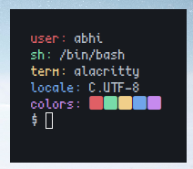

# Tinyfetch
A simple fetch in C which is tiny and fast.. it takes 0.001 to 0.004s to fetch

## Depends
- only c compiler and `TERM`, `LANG`, `USER`, `SHELL` environmental variables

## Installation

```
$ git clone https://github.com/abrik1/tinyfetch
$ cd tinyfetch/src
$ vim config.h # if you want to change config
$ gcc tinyfetch.c -o tinyfetch
$ ./tinyfetch
```
## Preview



## License

MIT License
